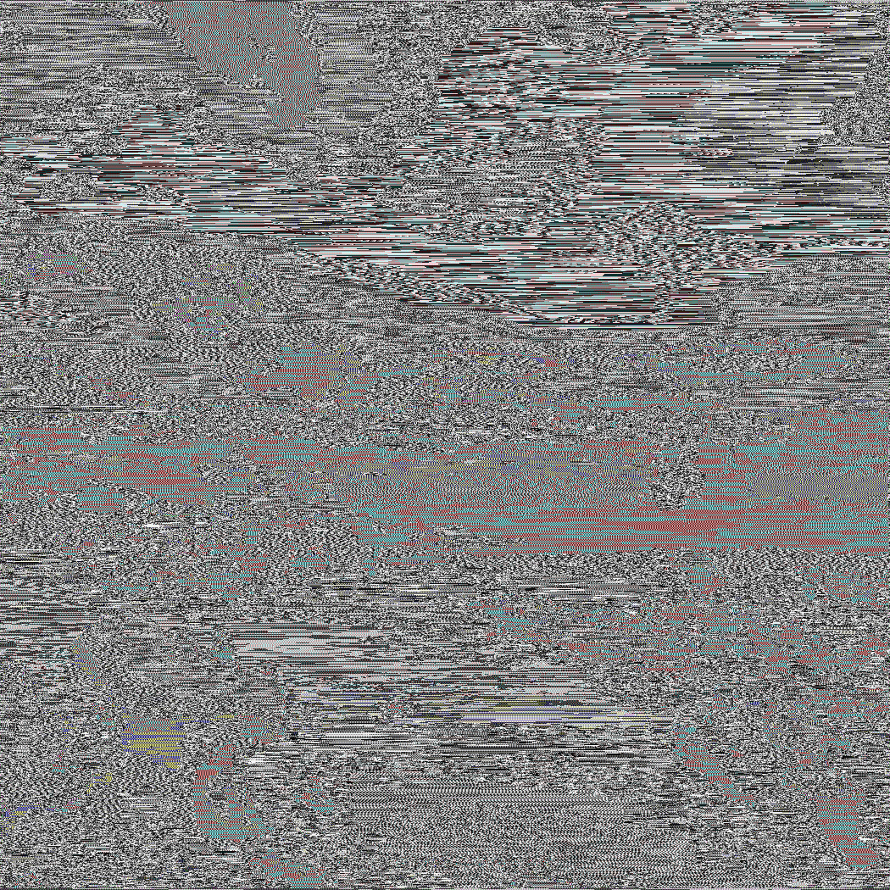

# XORDECRYPT

## 题目信息

- 类型：Crypto
- 题目状态：已解出
- 题目附件：`0x67.png`
- 题目描述：

```text
I feel CHAINED to my desk, looking for some positive FEEDBACK.
Flag Format: UDCTF{}
```

- 核心突破点：题面里的 `CHAINED` 和 `FEEDBACK` 指向“前一个字节参与当前字节”的链式 XOR；直接对图片原始字节流做 `cur ^ prev` 还原，就能在输出图里肉眼读到 flag。

## 入口与现象

附件只有一张 `png` 图，直接看原图基本就是一张噪声图，没有可见文本。题目名是 `XORDECRYPT`，描述里又刻意强调了 `CHAINED` 和 `FEEDBACK`，所以重点不该放在 PNG 尾部追加或普通隐写，而应该放在“链式异或还原”上。

这里最自然的假设是：图片像素字节流在生成时做过一次“当前字节和前一个字节相关”的 XOR 处理。既然题目让我们 `DECRYPT`，就可以直接对解码后的像素字节流按顺序恢复一版看看。

## 分析过程

### 1. 读取图片原始像素流

先把 PNG 正常解码成像素数据，然后把所有 RGB 字节摊平成一维数组。这样做的原因是题面提示的是“链式反馈”，更像对连续字节流处理，而不是对 PNG 压缩数据块或单独颜色通道分别操作。

### 2. 对字节流做链式 XOR 还原

这里直接尝试最朴素的一种：

```text
plain[0] = cipher[0]
plain[i] = cipher[i] ^ cipher[i - 1]
```

也就是当前字节与前一个密文字节异或，恢复出新的像素流。把恢复结果重新按原尺寸写回图片，得到 `flat_cprev.png`。

对应脚本如下：

```python
from PIL import Image
import numpy as np

img = Image.open("0x67.png").convert("RGB")
raw = np.frombuffer(img.tobytes(), dtype=np.uint8)

out = np.empty_like(raw)
out[0] = raw[0]
out[1:] = raw[1:] ^ raw[:-1]

Image.frombytes("RGB", img.size, out.tobytes()).save("flat_cprev.png")
```

### 3. 观察还原结果

把生成的 `flat_cprev.png` 打开后，图里已经能直接读出 flag。

原图：



还原图：


## 利用过程

1. 检查附件，确认只有一张噪声风格的 `png` 图片。
2. 根据 `XORDECRYPT`、`CHAINED`、`FEEDBACK` 判断主线是链式 XOR，而不是常规 PNG 隐写。
3. 将图片解码为原始 RGB 字节流。
4. 对字节流执行 `plain[i] = cipher[i] ^ cipher[i - 1]` 还原。
5. 保存为 `flat_cprev.png`，直接肉眼读出最终 flag。

## 关键 payload / 命令

```python
from PIL import Image
import numpy as np

img = Image.open("0x67.png").convert("RGB")
raw = np.frombuffer(img.tobytes(), dtype=np.uint8)

out = np.empty_like(raw)
out[0] = raw[0]
out[1:] = raw[1:] ^ raw[:-1]

Image.frombytes("RGB", img.size, out.tobytes()).save("flat_cprev.png")
```

## Flag

```text
UDCTF{xOr_TO_Th3_FLa@g}
```

## 总结

这题的难点不在复杂密码学，而在准确理解题面提示。`CHAINED` 和 `FEEDBACK` 已经把方向点得很明显了，真正有效的做法就是把图片当作线性字节流，尝试“前一个字节参与当前字节”的 XOR 还原。选对模型之后，输出图里会直接出现可读 flag。
