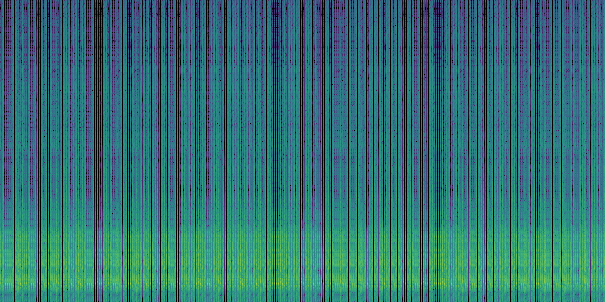
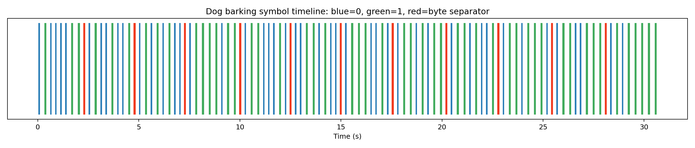

# Dog barking

## 题目信息

- 类型：Misc
- 题目状态：已解出
- 题目描述：`I recorded this audio at the dogpark the other day and I think the dogs were trying to tell me something???`
- 附件：`challenge.wav`
- 核心思路：音频里不是直接藏在 spectrogram 里的文字，而是三种重复出现的 bark 样本在编码数据。其中一种 bark 负责分隔字节，另外两种 bark 分别表示 `0/1`，按 8 位 ASCII 解码即可拿到 flag。

## 入口与现象

附件只有一个 wav：

```text
challenge.wav
mono / 16000 Hz / 16-bit PCM / 77.80 s
```

先把音频转成频谱图看整体结构：

```text
ffmpeg -y -i challenge.wav -lavfi "showspectrumpic=s=1800x900:legend=disabled:scale=log:color=viridis" -frames:v 1 -update 1 spectrogram.png
```

得到的图像虽然没有像常见频谱隐写那样直接出现文本，但有一个很明显的异常点：整段音频几乎全是非常规整的、重复的竖线脉冲，不像真实狗公园环境录音。



这一步可以先把方向缩小到“重复音频样本在传符号”，而不是语音识别、慢扫电视或者单纯看频谱找字。

## 分析过程

### 1. 先把每次 bark 分段出来

对音频做一个简单的移动 RMS 包络，再按阈值切分，就能把整段录音拆成离散的 bark 事件。切完后一共得到 `269` 个事件。

继续对每个事件单独做 FFT，会发现它们的主频只落在三类上：

- 约 `500.8 Hz`
- 约 `873.7 Hz`
- 约 `530.0 Hz`

也就是说，这不是很多种不同的狗叫，而是三种固定模板在反复出现。

### 2. 找到字节分隔符

把三种 bark 分别记成 `A / B / C` 之后，最关键的结构立刻出来了：

- 总事件数是 `269`
- 其中 `C` 正好出现了 `29` 次
- 把整段序列按 `C` 切开后，刚好得到 `30` 组
- 而且每一组长度都正好是 `8`

这基本就把编码方式锁死了：`C` 不是普通数据位，而是字节分隔符；真正承载数据的是 `A` 和 `B`。

下面这张时间线图更直观。蓝色是 `0`，绿色是 `1`，红色是字节分隔符：



前四组直接就是：

```text
ABAAAABB  ABAABAAB  ABABABAA  ABBBBABB
01000011  01001001  01010100  01111011
    C         I         T         {
```

到这里已经可以确认：

- `A = 0`
- `B = 1`
- 每组按 `MSB first` 解释

### 3. 按 ASCII 解码

把 30 组 8 bit 数据全部按 ASCII 转回去，得到：

```text
CIT{b4rking_up_th3_wr0ng_tr33}
```

这就是最终 flag。

## 关键脚本 / 命令

下面这段脚本就是我实际用来完成切分、分类和解码的最小复现版本：

```python
import wave
import numpy as np

with wave.open("challenge.wav", "rb") as w:
    fr = w.getframerate()
    x = np.frombuffer(w.readframes(w.getnframes()), dtype="<i2").astype(np.float32)

# 用移动 RMS 找 bark 包络
win = int(fr * 0.01)
env = np.sqrt(np.convolve(x * x, np.ones(win) / win, mode="same"))
thr = np.percentile(env, 75)
mask = env > thr

# 合并短空隙，得到离散 bark 片段
idx = np.flatnonzero(mask)
segs = []
max_gap = int(fr * 0.06)
if len(idx):
    s = idx[0]
    p = idx[0]
    for i in idx[1:]:
        if i - p <= max_gap:
            p = i
        else:
            segs.append((s, p))
            s = p = i
        p = i
    segs.append((s, p))

segs = [(a, b) for a, b in segs if (b - a + 1) / fr >= 0.05]

symbols = []
for a, b in segs:
    seg = x[a:b + 1]
    n = len(seg)
    f = np.fft.rfftfreq(n, 1 / fr)
    p = np.abs(np.fft.rfft(seg * np.hanning(n)))
    dom = f[np.argmax(p[1:]) + 1]

    if dom < 515:
        symbols.append("A")
    elif dom < 700:
        symbols.append("C")
    else:
        symbols.append("B")

parts = "".join(symbols).split("C")
flag = "".join(chr(int("".join("0" if ch == "A" else "1" for ch in part), 2)) for part in parts)
print(flag)
```

运行输出：

```text
CIT{b4rking_up_th3_wr0ng_tr33}
```

## Flag

```text
CIT{b4rking_up_th3_wr0ng_tr33}
```

## 总结

这题的关键不是“听出”狗在叫什么，而是先识别出整段音频其实是离散符号流。把 bark 事件分段后，可以很快发现只有三种固定模板，其中一种恰好每隔 8 个数据位出现一次，正好充当字节分隔符。剩下两种 bark 当作 `0/1` 做 ASCII 解码，flag 就直接出来了。
