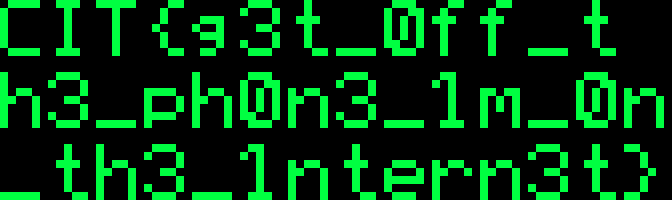

# Wiretap

## 题目信息

- 类型：Forensics
- 题目状态：已解出
- 附件：`beep_beep_boop.wav`
- 核心思路：先从音频里识别出电话拨号音、回铃音和 Bell 103 调制解调器信号，再把 300 baud 的 FSK 数据解成 HTTP 响应，最后从网页里的三段 SVG 像素图读出 flag

## 入口与现象

附件只有一个 wav：

```text
beep_beep_boop.wav
mono / 44100 Hz / 16-bit PCM / 237.79 s
```

先看频谱，能明显看到这不是普通录音，而是一段非常“规整”的电话音频：


前几秒能分出三段很典型的电话系统音：

1. `350 Hz + 440 Hz`，这是北美电话拨号音。
2. 中间夹着一串 DTMF 按键音。
3. 后面变成 `440 Hz + 480 Hz` 的回铃音，节奏也是标准的“响 2 秒，停 4 秒”。

这一步已经把方向缩得很小了：题目不是单纯的音频隐写，而是在模拟一通拨号上网的电话连接。

## 分析过程

### 1. 识别 Bell 103 调制解调器

回铃音之后，主频变成了两组很像电话调制解调器的 FSK 频率：

- `1070 / 1270 Hz`
- `2025 / 2225 Hz`

这正好对应 **Bell 103** 的两路信道。Bell 103 是早期 300 baud 全双工 modem，常见频率组合就是：

- Originate：`1070 / 1270 Hz`
- Answer：`2025 / 2225 Hz`

音频采样率是 `44100 Hz`，而 `44100 / 300 = 147`，刚好每个符号正好是 147 个采样点，所以直接按 300 baud 做非相干 FSK 判决就可以。

我只先解高频那一路 `2025 / 2225 Hz`，按每 147 个采样比较两个频点能量，再按 UART `8N1` 组帧，立刻能还原出一段很像网页返回包的数据：

```text
HTTP/1.0 200 OK
Server: Apache/1.3.6 (Unix)
Content-Type: text/html
Content-Length: 6519
Connection: close
```

也就是说，这段 wav 里藏着一整个拨号上网拿网页的过程。

### 2. 从响应里提取网页正文

把解出的 HTTP body 单独拿出来之后，可以看到是一个非常 90 年代风格的网页，标题是：

```html
<title>Dave's Corner of the 'Net!</title>
```

正文里最关键的一段是：

```html
Anyway while I was flippin thru the owner's manual ... there was this dorky little
pixel-art graphic printed at the bottom ... It was split across 3 lil scanlines.
```

下面还真的嵌了 3 段 SVG 像素图。到这里题目就很明确了：前面的 modem 解码只是为了把网页内容捞出来，真正的 flag 在这三段像素图里。

### 3. 还原 SVG 像素图

把网页里的三个 SVG 逐个解析成像素矩阵，再上下拼起来，图案如下：



这三行分别是：

```text
CIT{g3t_off_t
h3_ph0n3_im_0n
_th3_intern3t}
```

直接拼起来就是最终 flag。

## 关键脚本 / 命令

下面这段脚本就是我实际用来还原 Bell 103 高频信道的核心逻辑：每 147 个采样做一次判决，比较 `2025 Hz` 和 `2225 Hz` 能量，再按 `8N1` 取字节。

```python
import wave, numpy as np

with wave.open("beep_beep_boop.wav", "rb") as w:
    fr = w.getframerate()
    data = np.frombuffer(w.readframes(w.getnframes()), dtype="<i2").astype(np.float32)

start, end = 8.5, 237.2
x = data[int(start * fr):int(end * fr)]
spb = 147  # 44100 / 300
offset = 145

def tone_power(seg, fq):
    t = np.arange(len(seg))
    ang = 2 * np.pi * fq * t / fr
    c = np.dot(seg, np.cos(ang))
    s = np.dot(seg, np.sin(ang))
    return c * c + s * s

bits = []
for i in range(offset, len(x) - spb + 1, spb):
    seg = x[i:i + spb]
    bits.append(1 if tone_power(seg, 2225) > tone_power(seg, 2025) else 0)

out = []
i = 0
while i + 10 <= len(bits):
    if bits[i] != 0:
        i += 1
        continue
    datab = bits[i + 1:i + 9]
    if bits[i + 9] != 1:
        i += 1
        continue
    out.append(sum(b << k for k, b in enumerate(datab)))
    i += 10

print(bytes(out)[:200].decode("latin1", "replace"))
```

运行后就能看到 `HTTP/1.0 200 OK` 那段响应头。

## Flag

```text
CIT{g3t_off_th3_ph0n3_im_0n_th3_intern3t}
```

## 总结

这题最关键的不是“听”出什么，而是先从电话音的频率特征把协议识别出来。前半段的拨号音、DTMF 和回铃音负责告诉你“这是电话网”，后半段的 `1070/1270/2025/2225` 则把范围进一步锁到 Bell 103。把 modem 数据解出来之后，拿到的是一个网页响应，而网页里那三段 SVG 像素图才是最终藏 flag 的位置。
